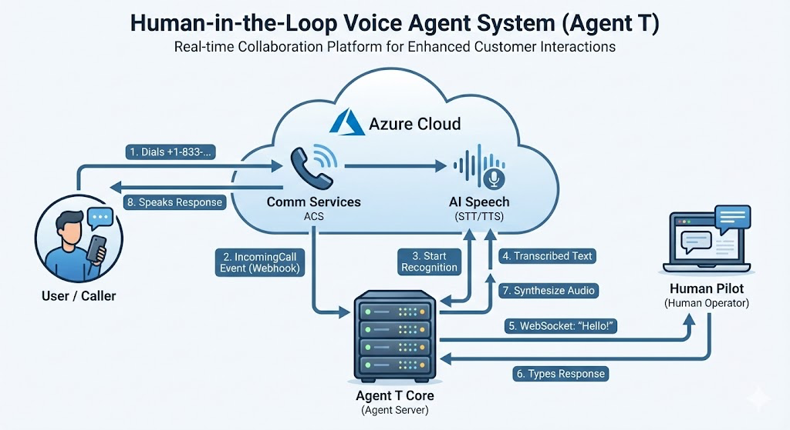

# Agent T: Human-in-the-Loop Voice Agent 🤖📞


> **The Ultimate Real-Time AI Voice Assistant with Human Oversight.**
> *Seamlessly blend AI speed with human empathy.*

**Agent T** is a state-of-the-art voice agent built with **Python**, **Azure Communication Services (ACS)**, and **Azure AI**. It features a revolutionary **"Human-in-the-Loop" (HITL)** architecture, allowing a human operator to monitor live calls via a real-time web dashboard, read instant transcriptions, and intervene by typing responses that are synthesized into natural speech immediately.

## 🚀 Why Agent T? (Use Cases)
*   **Customer Support**: AI handles the greeting, human takes over for complex resolution.
*   **Sales Coaching**: Managers can whisper or take over calls in real-time.
*   **High-Stakes Dispatch**: Emergency services where AI transcribes but humans verify every word.
*   **Language Translation**: Real-time speech-to-text-to-speech translation bridge.

## 🌟 Features

*   **📞 Inbound Call Handling**: Seamlessly accepts phone calls using Azure Communication Services.
*   **👂 Real-Time Transcription**: Converts caller audio to text instantly using Azure AI Speech ("The Ear").
*   **🖥️ Operator Dashboard**: A live web interface (WebSocket-powered) for humans to monitor conversations.
*   **⌨️ Human-in-the-Loop**: Operators can type responses that are synthesized into natural speech ("The Mouth") and played back to the caller.
*   **🧠 AI Ready**: Integrated with **Azure OpenAI (`gpt-4o-mini`)** for potential automated interactions.

## 🏗️ Architecture



1.  **Caller** dials the Azure Phone Number.
2.  **ACS** sends an `IncomingCall` webhook to the **Agent T Server**.
3.  **Server** answers the call and starts the **Azure AI Speech** recognizer.
4.  **Audio** is transcribed and broadcast via WebSockets to the **Web Dashboard**.
5.  **Human Operator** reads the text and types a response.
6.  **Server** uses **Azure TTS** to convert the text to audio and plays it back to the caller.

## 🚀 Setup & Installation

### Prerequisites
*   Python 3.10+
*   Azure Subscription with:
    *   Communication Services (with a Phone Number).
    *   Azure AI Speech Resource.
    *   Azure OpenAI Resource (optional for HITL, required for auto-mode).
*   [Ngrok](https://ngrok.com/) (for local development tunneling).

### 1. Clone the Repository
```bash
git clone https://github.com/taatim/Agent-T.git
cd Agent-T
```

### 2. Install Dependencies
```bash
python -m venv .venv
source .venv/bin/activate  # On Windows: .venv\Scripts\activate
pip install -r requirements.txt
```

### 3. Configure Environment
Create a `.env` file in the root directory (copy `env.example` if available) and fill in your usage:

```ini
# Azure Communication Services
ACS_CONNECTION_STRING="your_acs_connection_string"
ACS_PHONE_NUMBER="+1XXXXXXXXX"

# Callback URI (Will be auto-updated by run_agent.py if using ngrok)
CALLBACK_URI_HOST="https://your-ngrok-url.ngrok-free.app"

# Azure OpenAI (The Brain)
AZURE_OPENAI_SERVICE_KEY="your_openai_key"
AZURE_OPENAI_SERVICE_ENDPOINT="https://your-resource.openai.azure.com/"
AZURE_OPENAI_DEPLOYMENT_MODEL="gpt-4o-mini"

# Azure AI Speech (The Ear & Mouth)
# Use Managed Identity if possible, otherwise keys are handled in code
AZURE_SPEECH_SERVICE_ENDPOINT="https://your-speech-resource.cognitiveservices.azure.com/"
```

### 4. Run the Agent
We provide a helper script that automatically starts `ngrok` and the `FastAPI` server:

```bash
python run_agent.py
```

*   **Dashboard**: Open [http://localhost:8000](http://localhost:8000) in your brower.
*   **Ngrok**: The script will print your public HTTPS URL.

## 🧪 Usage

1.  Start the server.
2.  Open the **Web Dashboard** (`localhost:8000`).
3.  Call your **Agent T Phone Number**.
4.  You will see "Connected" on the dashboard.
5.  Speak into your phone. Watch the **Transcript** appear.
6.  Type a reply in the "Response" box and hit **Send**.
7.  Hear Agent T speak your message back to you!

## 🛡️ Troubleshooting

*   **Silent Agent?** Check the logs for `DeploymentNotFound`. Ensure your `.env` matches your Azure OpenAI model name (e.g., `gpt-4o-mini`).
*   **No Transcription?** Ensure your Azure Speech Resource is in the correct region and the endpoint is valid.
*   **Call Drops?** Verify your `ACS_CONNECTION_STRING` and that the Ngrok tunnel is active and updated in the `.env`.

## 📜 License
[MIT](LICENSE)


## 🔮 Future Roadmap: The "Human Agency" Mission

**Why this exists**: The story is personal. I called a patient appointment scheduling system, was connected to an AI agent, and it failed to schedule my 3-week follow-up. Instead, it assumed I was a new patient and gave me an appointment **3 months away**.

**Agent T is the counter-measure.** It is designed to fight "Bad AI" with "Good AI," restoring human agency in a world of automated gatekeepers.

### Backlog
- [ ] **Outbound Calling**: The ability for Agent T to call *them* and hold the line.
- [ ] **Appointment Negotiation**: Smart logic to refuse "default" slots and negotiate for the correct time window.
- [ ] **Privacy-First PII Protection**: When asked for sensitive info (SSN, DoB), the Agent **pauses** and waits for your input. *It never stores this data*, acting only as a secure voice relay.
- [ ] **"Fight Agent with Agent"**: A mode specifically tuned to navigate IVR trees, bypass basic bots, and reach a human scheduler.
- [ ] **Creating Human Agency**: Tools that give the user superpowers—like "Escalate to Manager" detection or "Record for Evidence."

## 🏷️ Tags & Keywords
`Voice Agent`, `Human-in-the-Loop`, `HITL`, `Azure Communication Services`, `Azure OpenAI`, `GPT-4o`, `Real-time AI`, `Speech-to-Text`, `Text-to-Speech`, `Python`, `FastAPI`, `WebSockets`, `Customer Experience`, `Voice AI`, `Conversational AI`, `Telephony`, `Twilio Alternative`, `AI Copilot`.
